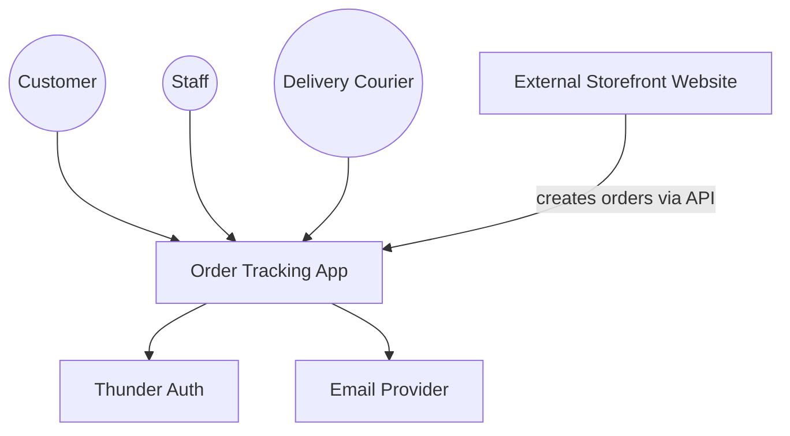
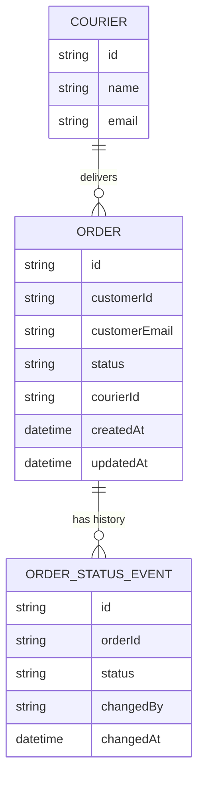
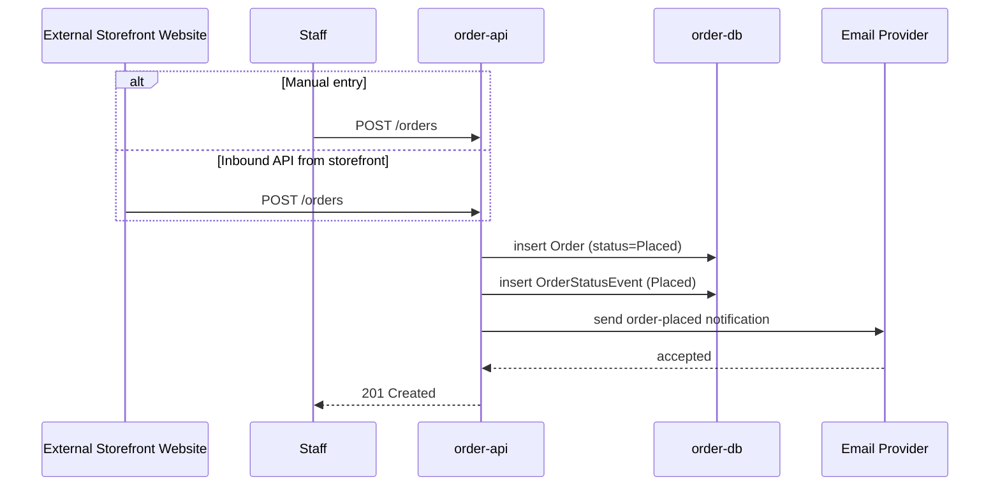
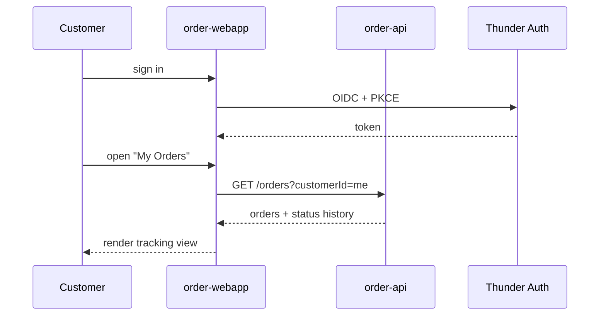

# Order Tracking App — Design

## Overview

The system is a single Ballerina API (`order-api`) backed by a Postgres
database (`order-db`), fronted by one React single-page application
(`order-webapp`) that serves three signed-in roles — Customer, Staff, and
Delivery Courier — each with its own screens behind a shared shell. Orders
enter the system either through manual staff entry or through an inbound API
call from the external storefront website. `order-api` owns the order
lifecycle (status transitions, history, courier assignment) and sends email
notifications through an external email provider whenever an order's status
changes. All three roles authenticate through Thunder, the platform IDP.

## Context (C1)

## Domain model (ER)

## Key flows

### Order creation (manual + inbound API)

### Status update and customer notification

### Customer tracks an order

# Order Tracking App — Design

## Overview

The system is a single Ballerina API (`order-api`) backed by a Postgres
database (`order-db`), fronted by one React single-page application
(`order-webapp`) that serves three signed-in roles — Customer, Staff, and
Delivery Courier — each with its own screens behind a shared shell. Orders
enter the system either through manual staff entry or through an inbound API
call from the external storefront website. `order-api` owns the order
lifecycle (status transitions, history, courier assignment) and sends email
notifications through an external email provider whenever an order's status
changes. All three roles authenticate through Thunder, the platform IDP.

## Context (C1)

## Domain model (ER)

## Key flows

### Order creation (manual + inbound API)

### Status update and customer notification

### Customer tracks an order

